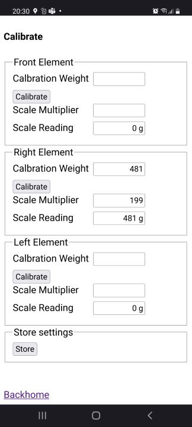

# Open CG-Scale V2.0

### About the project

The Version 2.0 is a complete firmware rework of [OpenCgScale](https://github.com/RollingGecko/OpenCgScale). The main difference is that the scale acts as an access point and the UI is provided as an HTML-Page.

The complete project is open source. 

The weight and the CG is measured by 3 scale modules places under the landing gear of the airplane. Everything is powered by an ESP32.
The position of the CG is projected by a laser on the bottom of the plane. 

The measuring of distance between the front and main landing gear is supported by a laser, that points to the middle of the main gear.

#### About the UI
All information are shown on a web-page.

The scale has an access point you can get access with all devices with wifi and a browser. 

##### Pre-configured

ssid:       CgScale
password:   jetflight
web-page:   192.168.0.1

This are the standard-settings and can be changed in config.h

##### Handling

###### Calibration
To calibrate the scale, use the link *calibration*. That opens a new page

Put a know weight for calibration on the scale-element and enter the weight in the field *Calibration Weight*. The scale makes 10 readings and calculates a Scale Multiplier and gives it back to the UI.

If the measuring is not accurate enough repeat the process. 

After all elements are calibrated use the *Store* Button. The settings are stored as a JSON-file in the file system of the ESP32.

'Backhome* leads you back to the main page.

###### Using the scale

Start the scale. The scale makes a *tare* on startup. You can tare the scale over the button *scale*.

Place the landing gear under the plane.

With the checkbox *Laser on* You can switch on the Laser that helps you to measure die distance from middle of the maim gear and the middle of the front gear. Enter this in the field *Distance main gear* in mm.

The current CG is calculated referenced from the middle of the front gear.

The vertical laser helps to find the CG on the plane.

### Hardware

All parts are printed 3d. Files are provided as [(STL)](https://github.com/RollingGecko/CgScale/tree/master/Parts/STL). Some aluminum parts are required. But they can simply be cutted from aluminum profile [(PDF)](https://github.com/RollingGecko/CgScale/blob/master/Parts/Alu-Parts_Drawing.PDF).

### Electronic
#### Based on ESP32. 

* Used Board ESP32 WeMos LOLIN32 Lite V1.0.0
  * https://wiki.wemos.cc/products:lolin32:lolin32_lite
  * https://arduino-projekte.info/wemos-lolin32-lite/ (German)
* The Board provides an Lipo Battery Charger
#### Scale

* Used 10 kg load cell together with the [HX-711](https://github.com/bogde/HX711.git) board you can find for example
  * on ebay: https://tinyurl.com/ybxn4rfh
  * on aliexpress: https://tinyurl.com/y78dd9gv

#### Laser pointer module
 * From ebay like https://tinyurl.com/y8mcnznn
 * Aliexpress https://tinyurl.com/ydeltejj

#### Circuit

The PIN-setting to the esp32 is configured in the config.h file.

### PlatformIO

The project is developed with PlatformIO in Visual Studio Code. So the project can directly be opened with Platformio.

#### Deploying to the ESP32

The board Lolin32 lite in available as environment. Platformio pulls automatically the required libraries. The environments are configured within *platformio.ini* file.

Follow the following steps:

Select the environment

Upload the code

Upload Spiffs-Image

1) Select Platformio
2) Build Filesystem Image
3) Upload Filesystem 

#### Deploying in Dummy-Mode

If you want to try out the UI or even want to contribute to the UI-develop you can deploy a "Dummy-Mode" to the esp32. Just uncomment in *config.h* the line

        //Dummies

        #define SCALE_DUMMY

The load-cells are simulated as a dummy. On the REST-API are different debug endpoints defined:

###### Change simulated weight

        curl -X POST -H 'Content-Type: application/json' -i 'http://192.168.0.1/debug/setWeight' --data '{
        "frontWeight":"1000",
        "rightWeight":"2000",
        "leftWeight":"2000"
        }'

###### Read saved scale-multipliers

        curl -X GET -i 'http://192.168.0.1/debug/scaleMultiplierJson'

I use the RestClient as Firefox-Plugin https://addons.mozilla.org/de/firefox/addon/restclient/ to set a Rest-Call.
## Used Libaries
* ottowinter/ESPAsyncWebServer-esphome@^2.0.1
* bblanchon/ArduinoJson@^6.18.5
* bogde/HX711@^0.7.4

